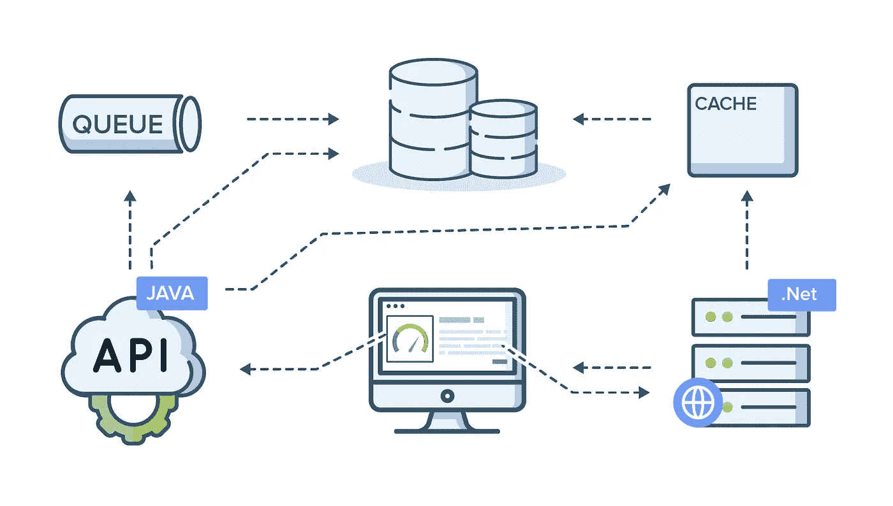
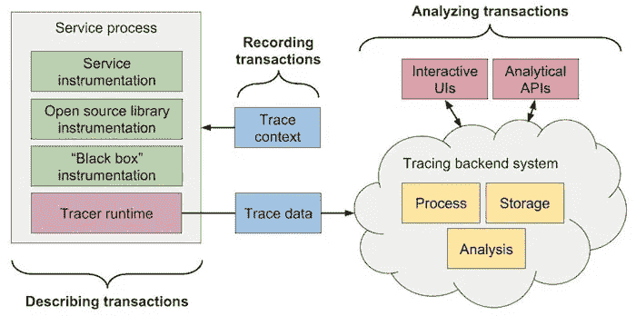

# 什么是分布式跟踪，它是如何工作的？

> 原文：<https://infosecwriteups.com/what-is-distributed-tracing-and-how-does-it-work-f0bd6247e1f0?source=collection_archive---------1----------------------->

由[乌列尔 SC](https://unsplash.com/@urielsc26?utm_source=unsplash&utm_medium=referral&utm_content=creditCopyText) 在 [Unsplash](https://unsplash.com/@urielsc26?utm_source=unsplash&utm_medium=referral&utm_content=creditCopyText) 上拍摄的照片

**什么是分布式追踪？**

[来源](https://www.site24x7.com/distributed-tracing.html)

各种规模的企业都可以受益于当今市场上许多不同软件和架构选项提供的创新功能和易用性，例如 Kubernetes 和 Docker。Kubernetes 和 Docker 只是这种软件和架构选项的两个例子。微服务被全世界的企业广泛使用，因为它们提供了多样化的服务选择，同时也使得企业在企业级上部署和扩展微服务变得简单。监视和调试系统必须变得越来越耗时，以便跟上由大量微服务组成的环境的不断增长的复杂性，并且在后端处理大量不同的系统，这变得越来越困难。这是因为在如此复杂的环境中诊断故障非常困难，导致系统变得越来越慢。

客户对整个组织的看法恶化，结果对其整体绩效产生负面影响。通过在请求从一个服务移动到下一个服务时收集数据来跟踪和观察服务请求通过分布式系统的能力称为分布式跟踪。这是至关重要的，因为给定的环境可能有大量的微服务，我们需要每一个微服务的正确信息。在理解整个微服务生态系统中的请求流之前，您必须首先掌握系统中正在发生的事情。只有到那时，您才能确定问题或性能困难出现的位置和原因。

**分布式跟踪是如何工作的？**

[来源](https://newrelic.com/blog/how-to-relic/understanding-distributed-tracing)

分布式跟踪和日志记录看起来是一样的，但是两者之间有很大的区别。两者都做日志，用来发现问题。日志管理系统是跟踪应用程序生成的所有数据的一种方式，这些数据包括错误、正在处理的请求以及其他内容。这是通过使用应用程序生成的日志来实现的。日志记录用于确保系统运行良好，并且所有的资源都以正确的方式使用。它们还可以用于许多其他事情，比如根据数据库中的某个日志条目发出警报。记录流程时，流程的每个步骤都会单独记录下来。如果同时访问多个系统，每个系统的所有日志都将保持独立。分布式跟踪是一种在单个事务从一个位置移动到另一个位置时跟踪该事务的方法。例如，从发出请求到向用户发送响应之间发生的所有事情都与该请求特有的 trackingId 保存在一起，而不是单独保存。许多不同类型的元数据都是由分布式跟踪生成的，因此可以用它来清楚地了解应用程序是如何跨所有微服务和容器工作的。它还缩短了发现错误的时间，这意味着可以快速找到根本原因。

因此，分布式跟踪在某种程度上类似于日志，但它不维护单独的日志，而是收集请求的日志并分配给跟踪 Id。

**日志记录和分布式跟踪的不同**

尽管分布式跟踪和日志记录看起来是一回事，但还是有显著的区别。它们既记录事物，又被用来解决问题。日志管理系统是一种跟踪应用程序生成的所有数据的技术，例如错误、正在处理的请求等等。它通过利用应用程序的日志来实现这一点。日志记录用于确保系统正常运行，并且所有资源都得到适当使用。它们还可以用于各种附加任务，例如基于某个数据库日志条目生成警报。在记录过程时，过程的每个步骤都被单独记录。如果同时访问多个系统，每个系统的所有日志都将单独维护。术语“分布式跟踪”指的是一种跟踪单个事务从一个位置到另一个位置的方法。从发出请求到用户收到响应之间发生的所有事情都用一个对该请求唯一的 **trackingId** 集中保存，而不是单独维护。分布式跟踪生成许多不同形式的元数据，因此它可以用来清楚地了解应用程序如何跨其所有微服务和容器工作。它还减少了检测问题所需的时间，从而更容易查明问题的根源。

**最后的话**

当我们有许多不同的微服务运行时，分布式跟踪工作得相当好。如果您居住在一个特别复杂的区域，您就不能使用日志记录活动，因为它们可能无法为您提供合适的图像。它还有助于故障排除和识别问题。