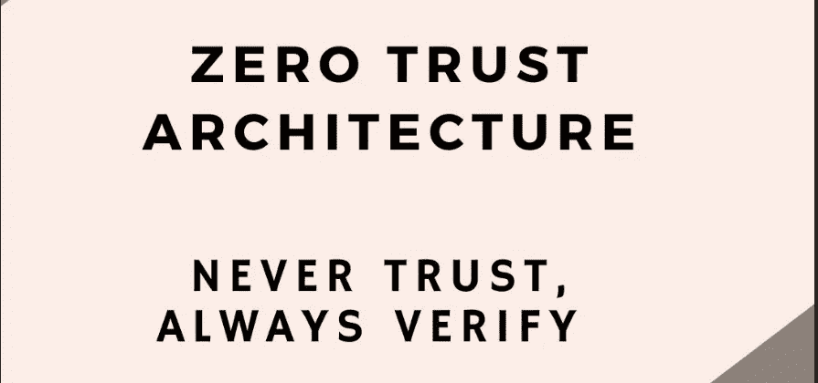

# 零信任架构

> 原文：<https://infosecwriteups.com/what-is-zero-trust-architecture-33186c17b63e?source=collection_archive---------2----------------------->

## **永远不要相信，永远要验证**

注意:这篇文章更多的是我的学习，而不是一篇研究文章

根据特别出版物(NIST SP)—800–207…

*“零信任(ZT)是一套不断发展的网络安全模式的术语，该模式将防御从静态的、基于网络的边界转移到关注用户、资产和资源。零信任架构(ZTA)使用零信任原则来规划工业和企业基础设施和工作流程。零信任侧重于保护资源(资产、服务、工作流、网络帐户等)。)，而不是网段，因为网络位置不再被视为资源安全状况的主要组成部分。本文档包含零信任架构(ZTA)的抽象定义，并给出了零信任可以改善企业整体信息技术安全状况的一般部署模型和使用案例。”*

零信任是约翰·金德瓦格在 2010 年创立的。零信任不是让系统可信，而是通过实施粒度级访问控制和高级安全系统(如 MFA(多因素身份认证)、自带设备(BYOD)、下一代防火墙和访问管理解决方案)来消除信任。我们可以部署 ZTA 是一个 5 向模型。让我们分解并理解每一个

# **1。识别保护面**

在 ZTA，首先我们需要识别一个“ ***护面*** ”。这个受保护表面由组织的关键和有价值的数据、资产、应用程序和服务(DAAS)组成。这种受保护面因组织、位置和动态企业而异。

# **2。绘制交易流程图**

一旦确定了受保护表面，我们就需要检查受保护表面的事务流，方法是确定哪些服务正在其中运行，谁需要访问该表面，以及该表面的流量。一旦我们了解了 DAAS 和基础架构之间的相互依赖关系，我们就需要在受保护面周围实施一个微边界，以持续保护受保护面。

# **3。构建零信任架构。**

接近 ZTA 有多种方法，如下所述:

*   ZTA 使用增强的身份治理
*   使用微分割的 ZTA
*   ZTA 使用网络基础设施和软件定义的参数。

一旦我们决定了需要遵循的方法，就有多种基于环境部署 ZTA 的方法。部署变化，如基于代理，基于飞地，基于门户和应用沙箱，以保护表面免受额外的威胁。完整的 ZT 解决方案将包括所有三种方法的要素。这些方法包括增强的身份治理驱动、逻辑微分段和基于网络的分段。

# **4。创建零信任策略**

零信任(ZT)策略定义了谁可以随时通过微边界，防止访问受保护的表面。我们需要建立网关来控制和防止威胁，并在整个表面上实施粒度级访问。ZT 政策因 ZTA 方法而异

*   使用身份治理方法的 ZTA 使用身份参与者作为构建策略的关键元素。在创建策略之前，管理员需要确定需要访问企业数据的属性/参与者以及他们需要的访问级别。该策略还需要包括在向身份参与者授予访问权限之前批准访问权限授予请求的流程。身份治理还需要在网络级别进行维护，并根据角色设置公共访问和内部企业访问之间的分段。还需要定期审查这些网络访问，以避免来自威胁媒介的攻击。
*   使用微分段方法的 ZTA 是基于将个人或组放置在基础设施上提供作为网关安全组件。在这种方法中，企业放置基础设施设备，如智能交换机(或路由器)或下一代防火墙(NGFWs)或专用网关设备，作为保护资源或一小组相关资源。这些设备的主要目的是授权人员、资产或服务的访问。
*   ZTA 使用网络基础设施和软件定义的周界方法在第 7 层进行设置，以实现客户端和资源之间的安全通信。这种方法也可以称为软件定义的边界，它使用 SDN 作为基本参考。

# **5。维护&监控 ZTA**

一旦实施了该策略，我们需要持续监控受保护的表面。应定期审查 DAA 之间的保护表面和微观依赖性。ZT 需要一致的可见性、实施和控制，这些可以直接在设备上或从云中提供。用作安全组件的网关监控流量、阻止威胁，并在内部环境和云环境中实施粒度访问级别控制。在拥有大型基础架构和应用程序的动态企业中，应定期审查受保护表面。

# **与零信任架构相关的威胁**

即使在实施 ZTA 之后，也出现了与之相关的新威胁。没有解决方案或流程可以提供 100%的安全性，每个组织都不太可能以这样或那样的方式容易受到攻击。正确实施和维护的 ZTA 可以降低整体风险，防范常见威胁。但是，在实施 ZTA 时，一些威胁具有独特的特征。

*   颠覆 ZTA 的决策过程
*   拒绝服务或网络中断
*   被盗凭据/内部威胁
*   网络上的可见性
*   系统和网络信息的存储
*   依赖专有数据格式或解决方案
*   在 ZTA 政府中使用非个人实体(NPE)

# **迁移到(零信任架构)ZTA**

迁移或实施到 ZTA 是一个持续的过程，而不是一个替代过程。任何组织都不可能一下子完全迁移到 ZTA。这是一个实施零信任策略、部署安全基础设施的渐进过程。由于这是一个一致的过程，组织正在决定是采用完整的 ZTA，还是采用基于外围架构的混合 ZTA。

感谢您花时间阅读本文。本文是在参考了下面列出的多个参考资料的基础上撰写的。我将把我的知识分享给给我机会学习这个的社区……:)

 [## 零信任架构

### 官方网站使用。gov A.gov 网站属于美国的一个官方政府组织。安全…

www.nist.gov](https://www.nist.gov/publications/zero-trust-architecture)  [## 什么是零信任架构

### 零信任是一项战略计划，通过消除信任的概念来帮助防止成功的数据泄露…

www.paloaltonetworks.com](https://www.paloaltonetworks.com/cyberpedia/what-is-a-zero-trust-architecture)  [## 零信任架构:AWS 视角|亚马逊网络服务

### 我们亚马逊网络服务(AWS)的使命是代表我们的客户进行创新，让他们的工作量越来越少…

aws.amazon.com](https://aws.amazon.com/blogs/security/zero-trust-architectures-an-aws-perspective/)  [## 零信任架构解释

### 这个博客是由第三方作者写的。随着…的频率、复杂性和成本的增加

cybersecurity.att.com](https://cybersecurity.att.com/blogs/security-essentials/what-is-a-zero-trust-architecture)