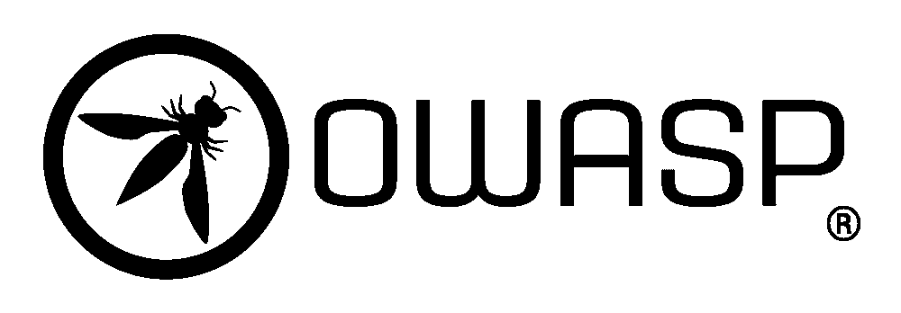

# 为什么我支持 OWASP 2021 年十大新类别—不安全的构建/部署环境？

> 原文：<https://infosecwriteups.com/why-am-i-rooting-for-a-new-category-in-owasp-top-10-2021-insecure-build-deployment-environment-e255242530e9?source=collection_archive---------2----------------------->

来源:https://owasp.org/

今年早些时候，OWASP 宣布计划发布全新的 OWASP TOP10 2021。

OWASP 发布了一项[公开调查](https://www.owasptopten.org/building-the-2021-top-ten-survey)，以收集在黑/灰箱测试中不容易识别的漏洞信息，但这些漏洞仍然与应用程序的整体安全状况相关。

因此，我决定[提交一个新的漏洞类别](https://github.com/OWASP/Top10/issues/512)“不安全的构建和/或部署环境”。

本文将提供提交该类别背后的一些基本原理。尽管它与源代码本身的漏洞无关，但它可能会对应用程序的整体安全状况产生极其负面的影响。

**敏捷软件开发**

传统上，变更管理是一个非常明确的过程。您可以在互联网上找到数百篇文章，解释在转移到生产环境之前，应该如何正确地请求、开发、测试和批准每个变更。

传统的变更管理流程

显然，这些步骤中的每一步都需要文档和适当人员的正式批准(签署)。这一过程为安全工程师提供了几次机会，以确保更改不会引入任何新的漏洞，并且部署应用程序的基础架构得到了加固和修补。

对于敏捷软件开发和 DevOps 方法来说，变更管理过程的安全性变得更加复杂，因为每天都会引入数十个小的变更。每一个微小的变化都会从不同的角度进行自动测试，如果一切如预期的那样，它会被部署到您选择的环境中，无需人工干预。

来源:[https://intland . com/WP-content/uploads/2019/07/devo PS-infinity-1-1 . png](https://intland.com/wp-content/uploads/2019/07/devops-infinity-1-1.png)

显然，自动化的水平和是否需要人工批准的决定很大程度上取决于您的组织的规模和风险偏好，但通常的想法是将人工工作减少到绝对最小。

**敏捷软件开发的安全控制**

在没有任何人工审查的情况下，变更管理和安全控制严重依赖于以下事实:

*   人类不能以不受控制的方式进入敏感环境
*   独立审查应用程序和基础架构的代码，以避免未经授权的更改并检测缺陷
*   在构建应用程序时使用预先批准和验证的工件，以降低不安全依赖或恶意工件的风险
*   流水线执行自动测试来检测缺陷或安全问题

不言而喻，规避任何上述控制的能力可能会给应用程序带来未经授权的更改和安全问题。

令人惊讶的是，你有很多文章提到管道的*安全性(SAST、SCA、DAST)，但是几乎没有文章描述管道*的*安全性的技术方面。因此，我认为应该开始提高对这个问题的认识，因为最近的事件表明攻击者正在利用这些问题。*

**此类漏洞示例**

*例#1:*

不受限制地访问保护不力的 CI 工具。未经授权的用户以不受控制的方式访问和修改管道配置。结果，他/她禁用了阻止他/她将易受攻击的应用程序部署到敏感环境的所有安全检查。

*旁注—由于 CI 工具通常具有广泛的网络访问权限，保护不当的 Jenkins 实例可能导致多个系统受损。*

*例 2:*

VCS 工具在技术上并不强制执行代码审查，因此恶意攻击者或粗心的员工会在应用程序中引入后门，并将其部署到生产环境中。

*例 3:*

不适当的访问隔离。如果对您的构建环境的访问没有被正确地隔离和/或在 pull 请求时执行管道，恶意用户可能会使用您的生产机密(您的 CI 工具可以访问这些机密)将您的应用程序的恶意版本部署到敏感的环境中。

*例 4:*

缺少或未正确实施签名流程。心怀不满的员工或恶意攻击者可以以未经授权的方式修改您的工件，并将其部署到敏感的环境中。

*例 5:*

错误配置的工件管理工具或映像注册表允许开发人员从不可信的来源获取映像和依赖项，而无需任何额外的验证。

**总结**

总之，很明显，建议的漏洞类别与不安全的编码实践没有直接关系，因此这种候选资格可能会有点争议。同时，我认为类似于 OWASP Top 10 中的“日志记录和监控不足”，我们应该围绕软件开发生命周期的其他非显而易见的安全问题提高意识。

我想借此机会鼓励大家为 OWASP Top10 年十大新风险类别投票。即使您认为该漏洞类别不适合 OWASP 十大漏洞，列表上还有许多其他项目可供选择:

[https://docs . Google . com/forms/d/e/1 faipqlsfi-uzbp 52 ayimpebwwynzqgqhlt 8 V5 wpom 30 r 8s 3c G1 yow/view form](https://docs.google.com/forms/d/e/1FAIpQLSfi-uzBp52AyvImpebWwYnzqGqhLT8V5wpwOm30r8s3Cg1Yow/viewform)

**外部参考**

对于那些对阅读这个问题感兴趣的人，我推荐以下文章:

*   [https://www . ncsc . gov . uk/collection/developers-collection/principles/secure-the-build-and-deployment-pipeline](https://www.ncsc.gov.uk/collection/developers-collection/principles/secure-the-build-and-deployment-pipeline)
*   [https://www . ncsc . gov . uk/blog-post/defining-software-build-pipelines-from-恶意攻击](https://www.ncsc.gov.uk/blog-post/defending-software-build-pipelines-from-malicious-attack)
*   [https://sprocketfox.io/xssfox/2021/02/18/pipeline/](https://sprocketfox.io/xssfox/2021/02/18/pipeline/)
*   [https://www . csoonline . com/article/3601508/solarwinds-supply-chain-attack-explained-why-organizations-not-prepared . html](https://www.csoonline.com/article/3601508/solarwinds-supply-chain-attack-explained-why-organizations-were-not-prepared.html)
*   [https://medium . com/@ Alex . birsan/dependency-confusion-4 a5d 60 FEC 610](https://medium.com/@alex.birsan/dependency-confusion-4a5d60fec610)
*   [https://snyk.io/blog/publishing-malicious-packages/](https://snyk.io/blog/publishing-malicious-packages/)
*   [https://www . trend micro . com/vinfo/hk-en/security/news/virtual ization-and-cloud/malicious-docker-hub-container-images-cryptocurrency-mining](https://www.trendmicro.com/vinfo/hk-en/security/news/virtualization-and-cloud/malicious-docker-hub-container-images-cryptocurrency-mining)
*   [https://www . co durance . com/publications/2019/05/30/access-and-dumping-Jenkins-credentials](https://www.codurance.com/publications/2019/05/30/accessing-and-dumping-jenkins-credentials)