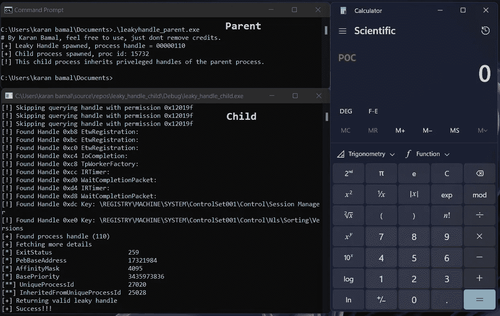

# Windows 应用程序开发系列第 1 部分—泄漏句柄

> 原文：<https://infosecwriteups.com/windows-application-exploitation-series-part-1-leaky-handles-dae031011a4e?source=collection_archive---------3----------------------->

# **关于 windows 应用程序开发系列:**
在这个系列中，我们将看看开发 Windows 应用程序的几种独特方法。

***完整故事上:***[***https://rehacks . live/t/windows-应用-开发-系列-部分-1-漏洞-句柄/***](https://rehacks.live/t/windows-application-exploitation-series-part-1-leaky-handles/14)

# **第 1 部分:泄漏手柄**

Github 回购链接
[https://github . com/abankalarm/re hacks/tree/main/Leaky % 20 handles](https://github.com/abankalarm/ReHacks/tree/main/Leaky%20Handles)

**什么是手柄？根据 MSDN，对象是代表系统资源的数据结构，可以是文件、进程、线程等。
然而，我们不能与它们直接交互，要访问资源或对象我们需要它们的句柄。**

获取句柄很简单，可以通过多种方式完成，使用 OpenProcess 的一个简单示例是:

> int PID =<insert pid="" here="">；
> HANDLE h PROCESS = open PROCESS(PROCESS _ ALL _ ACCESS，true，PID)；</insert>

但是，要获得进程的句柄，您需要有一定的权限。用户进程不能只获得管理员进程的句柄并直接对其进行更改，因为这将允许用户进程以更高的权限向进程中注入代码或控制其行为，这将最终导致诸如远程或本地权限提升、dos 等漏洞。

# **漏句柄及其继承**

这可以描述为一个场景，其中资源的句柄泄漏给另一个进程(子进程)，现在它可以与它原来无权访问的资源进行交互。

此时，理解句柄可以在父进程和子进程之间继承是很重要的，即使它们在不同的权限下运行。

[MSDN 句柄继承]([https://docs . Microsoft . com/en-us/windows/win32/sysinfo/handle-inheritance](https://docs.microsoft.com/en-us/windows/win32/sysinfo/handle-inheritance))对此进行了解释，并展示了一个相同的场景。

当应用程序打开一个资源的句柄而不关闭它时，它会导致句柄泄漏或内存泄漏，在这种情况下，内存被分配但从未被释放。

# **漏洞**

不关闭句柄或糟糕的编码会导致多种情况:

1.句柄没有关闭，但是攻击者不能以误用代码的方式注入代码。在这种情况下，攻击者仍然可以通过产生大量句柄来造成 DOS 条件，这些句柄将填满内存并最终使应用程序或系统崩溃。这也可以远程完成。
举例。[Telnet DOS]([http://cve.mitre.org/cgi-bin/cvename.cgi?name=2001-0346)**](http://cve.mitre.org/cgi-bin/cvename.cgi?name=2001-0346)**)
会话终止时，telnet 无法正确关闭句柄。这会导致资源耗尽，并导致无法建立新会话的拒绝服务情况。
尽管这是一个古老的例子，但这是相当普遍的。

2.当特权句柄泄漏给特权较低的进程时，它允许特权较低的进程提升其特权，从而导致特权提升的标准情况。
举例。【Cygwin local privilege escalation】([https://mast hoon . github . io/exploit/2019/03/29/cygeop . html)* *](https://masthoon.github.io/exploit/2019/03/29/cygeop.html)**)
我们将更多地关注这个场景。

完整报道:[https://re hacks . live/t/windows-application-exploation-series-part-1-leaky-handles/](https://rehacks.live/t/windows-application-exploitation-series-part-1-leaky-handles/14)