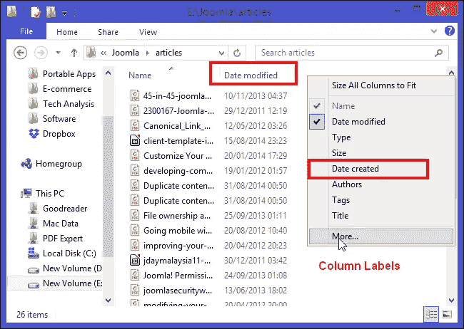

# 取证系统评论中的 Windows LNK 文件分析

> 原文：<https://infosecwriteups.com/windows-lnk-file-analysis-in-forensic-it-reviews-75b3dfd49f36?source=collection_archive---------1----------------------->

最近文件的概念用于描述用户最近访问的文件，在取证审查中，确定用户最近查看了哪些应用程序以及查看了哪些文档对于事件解决可能至关重要。在 Windows 操作系统中，在与用户帐户相关联的配置文件目录中的最近目录下，创建用户打开的文件的快捷方式文件。可以分析这些文件来确定用户最后访问了哪些文件。特别地，即使被用户删除或擦除的文件不能被访问，与它们相关联的快捷方式文件也可以被访问并检索关于它们的信息。

LNK 扩展链接文件的存储位置因操作系统而异。这些文件:

Windows XP:

*   \文档和设置\用户名\最近
*   \文档和设置\用户名\应用程序数据\Microsoft\Office\Recent

Windows Vista 和 Windows 7:

*   \用户\用户名\ AppData \漫游\Microsoft\Windows\Recent
*   \用户\用户名\ AppData \漫游\Microsoft\Office\Recent

目录。UserName 表示的变量是表示相关用户的用户名的变量。例如，对于名为 IsmailTasdelen 的用户，这些目录的确切表达式应该是\ Users \ Ismail tasdelen \ AppData \ Roaming \ Microsof \ Windows \ Recent。这些文件的创建时间表示用户曾经访问过文档的时间，最后更新时间表示最后一次访问文档的时间。例如，下面的屏幕截图显示了 Windows 7 系统中最近目录的一些内容。在这里，您可以通过查看“创建日期”和“修改日期”字段中的时间信息，找出第一个和最后一个文件被访问的时间。

哪些数据存储在 LNK 文件中？

分析 LNK 文件时会获得以下信息:

*   LNK 文件指向的目标文件或目录的完整路径
    创建、修改和访问目标文件或目录的时间信息
    目标文件或目录的大小
*   目标系统的 NETBIOS 名称和 MAC 地址
*   存储目标文件或目录的卷的序列号
*   如果通过网络访问目标文件和目录，则为网络共享名称
*   目标文件或目录的属性(例如，“只读”、“隐藏”、“系统”)

Windows LNK 分析实用程序(lp)

在 Windows 系统中可以用来分析 LNK 文件的应用之一是 http://tzworks.net/prototype_page.php?proto_id=11 的[下载的 LNK 解析工具，可以免费下载使用。下面你可以找到这个应用的例子。](http://tzworks.net/prototype_page.php?proto_id=11)

> lp <filename>[-csv]
> dir C: \ Users \ *。lnk / b / s | lp [-csv] - >如果要解析一个目录下的所有 lnk 文件时使用。
> dir "C: \文档和设置\ *。lnk" / b / s | lp [-csv]
> -csv =允许输出逗号分隔的值。</filename>

链接文件检查器

Lifer 是开源软件，可以在 Linux 环境下使用，可以解析 Windows LNK 文件，并从 http://code.google.com/p/lifer/downloads/list.[下载](http://code.google.com/p/lifer/downloads/list.)下载源代码后，按照以下步骤编译安装。

*   制造
*   sudo make 安装
*   使干净

该应用的示例性使用形式如下:

*   lifer -h ->提取帮助选项。
*   lifer linkfile.lnk ->解析 linkfile.lnk 链接文件并打印结果
*   lifer-s link file . lnk-->类似于上面的命令，只提供短格式的信息。
*   lifer -o tsv。/Links/> links.tsv 处理目录中的所有 lnk 文件，并生成 tsv 格式的输出。

Windows 文件分析器

Windows 文件分析器是另一个应用程序，可以在图形界面的帮助下分析 LNK 扩展快捷方式文件，可以从[http://www.mitec.cz/wfa.html.](http://www.mitec.cz/wfa.html.)下载

## 来自 Infosec 的报道:Infosec 每天都有很多内容，很难跟上。[加入我们的每周简讯](https://weekly.infosecwriteups.com/)以 5 篇文章、4 个线程、3 个视频、2 个 GitHub Repos 和工具以及 1 个工作提醒的形式免费获取所有最新的 Infosec 趋势！